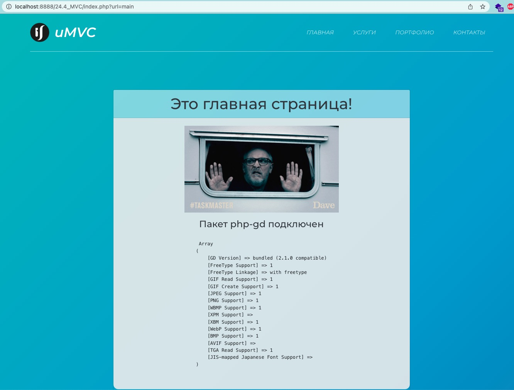
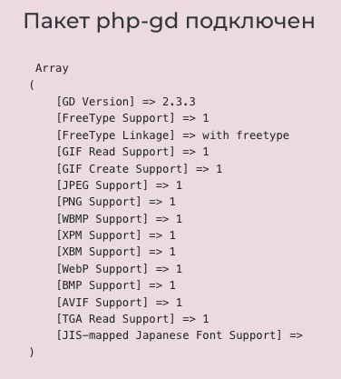

# Не вижу ошибок, о которых вы писали

Алиса, добрый день. Подскажите, вы написали, что у меня в задании 24.4_MVC есть следующие ошибки:

> PHP Fatal error: Uncaught Error: Failed opening required 'application/bootstrap.php' (include_path='.:/usr/share/php') in 24.4_MVC/index.php:3 Fatal error: Uncaught Error: Failed opening required 'core/model.php' (include_path='.:/usr/share/php') in 24.4_MVC/Application/Bootstrap.php:2 Причина: неверный нейминг файлов/неверное обращение к файлам в коде. Названия файлов и папок на диске и в коде должны совпадать, в том числе, по регистру.

>Отсутствует скриншот с перечнем модулей, который должен демонстрировать подключение модуля php-gd.

---
А у меня таких ошибок нигде не вылазит. Сайт работает и все переходит по ссылкам.  Модуль php-gd тоже подключен и об этом сделан вывод прямо на главной странице. 
Помогите плиз понять, где появляются данные ошибки? Потому что я их просто не вижу и поэтому не знаю, как исправить.

---

